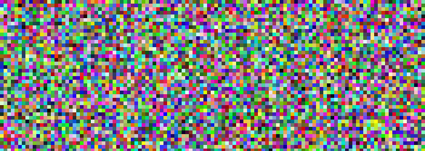

One of the first programming projects I ever did, back in 2016, was to try and convert 100 million digits of pi into a single image. I took a text file I found online of the first 100 million digits of pi in decimal, and went through every one and converted it into a color. The resulting image looked like complete random noise, and I was quite satisifed with the results. This lasted until my friend pointed out that the method I used for converting the pi digits into colors was lossy, so my image was not really pi after all. 
  

   

### The Problem

You see, my naive method for converting digits into colors went as following: I went through the digits in groups of 3 and mapped the number from the range 1000 down to 255, representing a RGB color channel. The issue with this is that during my remapping I had to round down my number, which meant that I was throwing away the information in the decimal part. This meant that in the end, 
my image was not really pi.  

Not being discouraged by this fact, me and my friend started thinking about how to actually display all of pi losslessly as an image. 
We figured that if we could have the digits of pi in binary form, we could losslessly convert 8 bits at a time into a color channel. The issue 
was how to convert our 100 million decimal digits into binary digits. The way to convert a number between bases is to repeatedly divide it,
for every power of two until the all the bits have finally been extracted. The problem is that performing a division takes n^2 time,
where n is the amount of digits. We also have to do this division for every single digit, so in the end our complexity becomes O(n^3). 
This made the conversion completely unfeasible with 100 millions of digit, even if we could have figured out how to divide such an extremely large number. Our teenage brains were defeated, and the project was archived.  
   

   

### The Solution

Fast forward to 2021. We couldn't let a problem lie unsolved. After some brainstorming, we figured out a way to decrease the complexity of the 
problem. By doing some online reading we found some mention of a more efficient method for converting between bases. 
By starting with a base closer to the square root of the digits and then using successively smaller bases, we could 
divide up the problem into smaller and smaller parts, effectively doing divide and conquer. This decreases the iterating 
over all digits from O(n) to O(log(n)). This now means that the complexity is O(n^2 * log(n)). Still completely unfeasible, but better.
The next step was optimizing down the complexity of the divison. With FFT, division can be taken down from O(n^2) to O(nlog(n)).
We were already using Pythons Decimal module to perform operations on our 100 million digits, and it turned out that 
the Decimal module was already doing FFT for the division. Our complexity was now down to O(n * log(n)^2). With all of this implemented, 
we were now able to convert 100 million decimal digits of pi into binary in just a few minutes! Hurray! Problem solved.

Of course, after some later research, it turns out that pi is available to ridiculous precision in hexadecimal form, which made most of the effort moot. 
However, the algorithm for converting a huge number into another base is barely documented on the web, so there was definitely some learning involved in making it work.

If you are interested in seeing the full 100 million digits of pi as an image, you can [find it here](./pi.png). You can also find [the source code for the project here.](https://github.com/wsandst/pi-visualizer)